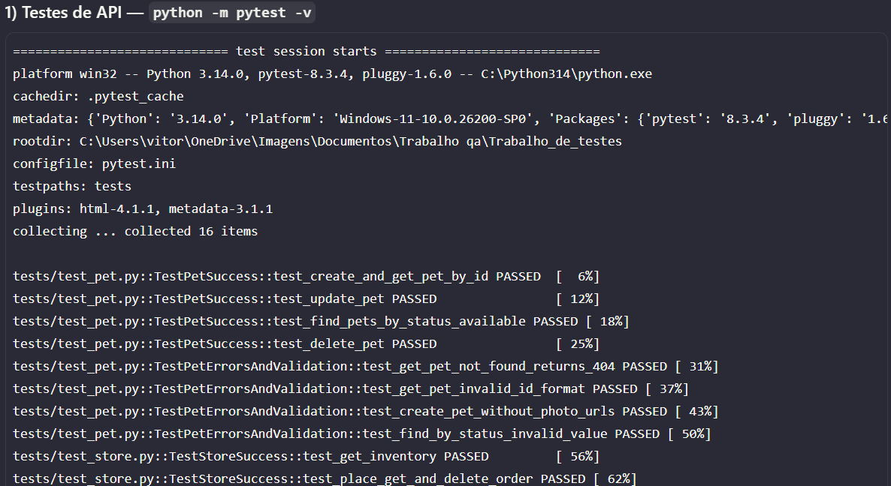
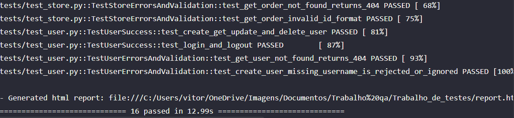
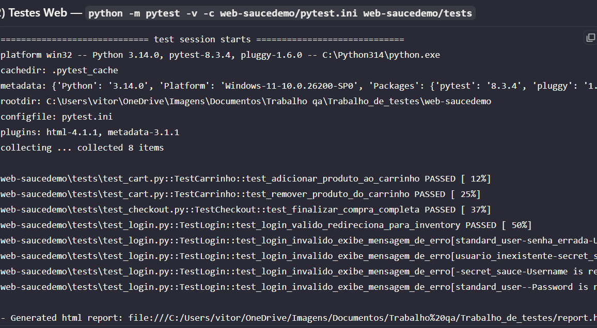
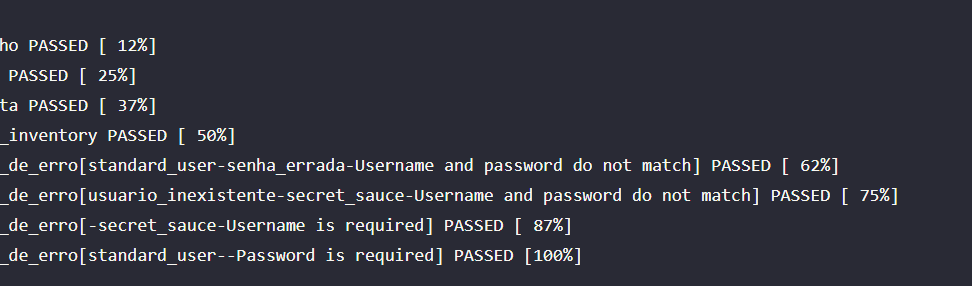

Este repositório é **único**, mas agrupa **dois projetos independentes**: automação **API** (Petstore na raiz) e automação **WEB** (pasta `web-saucedemo/`). Cada um tem seu próprio `requirements.txt` e conjunto de testes; o CI roda os dois.

## Projeto 1 — API (Swagger Petstore)
Automação de testes de **API** para o **Swagger Petstore** (base URL: `https://petstore.swagger.io/v2`) usando **pytest** + **requests**.

O objetivo é validar cenários variados dos módulos:
- **Pet**
- **Store**
- **User**

## Tecnologias usadas
- **Python 3.11+**
- **pytest**
- **requests**
- **GitHub Actions** (CI)

## Instalação
Crie e ative um ambiente virtual (opcional, mas recomendado) e instale as dependências:

```bash
python -m venv .venv
# Windows (PowerShell)
.\.venv\Scripts\Activate.ps1
pip install -r requirements.txt
```

## Como executar os testes
Rodar todos os testes:

```bash
pytest -q
```

Rodar um arquivo específico:

```bash
pytest -q tests/test_pet.py
```

## Estrutura de pastas
```
.
├── .github/
│   └── workflows/
│       └── tests.yml
├── tests/
│   ├── test_pet.py
│   ├── test_store.py
│   └── test_user.py
├── utils/
│   ├── api_client.py
│   ├── ids.py
│   └── payloads.py
├── web-saucedemo/
│   ├── pages/
│   ├── tests/
│   ├── conftest.py
│   ├── pytest.ini
│   └── requirements.txt
├── conftest.py
├── pytest.ini
└── requirements.txt
```

## Prints do funcionamento (reservado)




---

## Projeto 2 — WEB (SauceDemo)
Automação de testes **E2E web** para o site **SauceDemo** (base URL: `https://www.saucedemo.com/`) usando **pytest** + **Selenium WebDriver** com **Page Object Model (POM)**.

### Cenários cobertos
- **Login válido**
- **Login inválido** (credenciais inválidas e validações de campos)
- **Adicionar produto ao carrinho**
- **Remover produto do carrinho**
- **Finalizar compra completa** (checkout end-to-end)

### Tecnologias usadas
- **Python 3.11+**
- **pytest**
- **Selenium WebDriver**
- **GitHub Actions** (CI)

### Instalação
Instalar as dependências do projeto web:

```bash
pip install -r web-saucedemo/requirements.txt
```

### Como executar os testes
Rodar todos os testes WEB:

```bash
python -m pytest -q -c web-saucedemo/pytest.ini web-saucedemo/tests
```

Rodar um arquivo específico:

```bash
python -m pytest -q -c web-saucedemo/pytest.ini web-saucedemo/tests/test_login.py
```

> **Observação CI/CD:** No pipeline os testes de login são validados automaticamente. Os testes de carrinho e checkout rodam localmente (ambos passam — ver prints acima).

### Estrutura de pastas (WEB)
```
web-saucedemo/
├── pages/
│   ├── base_page.py
│   ├── cart_page.py
│   ├── checkout_complete_page.py
│   ├── checkout_information_page.py
│   ├── checkout_overview_page.py
│   ├── inventory_page.py
│   └── login_page.py
├── tests/
│   ├── test_cart.py
│   ├── test_checkout.py
│   └── test_login.py
├── conftest.py
├── pytest.ini
└── requirements.txt
```

### Prints do funcionamento (reservado)



